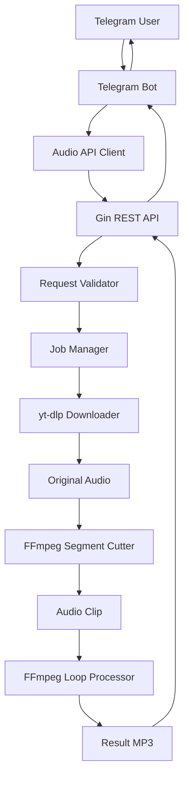

````markdown
# 🎵 YouTube Audio Looper

REST API and Telegram bot for generating looped audio clips from YouTube videos.

YouTube Audio Looper lets users select a specific segment from a YouTube video, repeat it to a custom duration, and receive the final MP3 file.

Built with Go, Gin, FFmpeg, yt-dlp, Docker, and Telegram Bot API.


---

## Overview

This project consists of two components:

- **REST API** — downloads audio, cuts a selected segment, loops it, and returns MP3.
- **Telegram Bot** — provides a simple step-by-step interface for users.

It was built to solve a real problem: quickly creating repeated audio loops from favorite parts of YouTube videos without manually downloading and editing files.

---

## Features

| Feature                | Description                                 |
| ---------------------- | ------------------------------------------- |
| YouTube audio download | Downloads audio using yt-dlp                |
| Segment extraction     | Cuts selected part using FFmpeg             |
| Audio looping          | Repeats selected segment to custom duration |
| MP3 output             | Returns ready-to-use audio file             |
| REST API               | Provides HTTP endpoint for audio generation |
| Telegram Bot           | Step-by-step user flow                      |
| Validation             | Validates URL, timestamps, and duration     |
| Job workflow           | Creates isolated processing jobs            |
| Docker support         | Runs API and dependencies in containers     |
| Health check           | Simple endpoint for monitoring              |

---

## Demo


Example bot flow:

```text
User: https://youtube.com/watch?v=...

Bot: Send start timestamp.

User: 00:42

Bot: Send end timestamp.

User: 00:47

Bot: Send final duration.

User: 01:00

Bot: Processing...

Bot: looped-audio.mp3
````

---

## Architecture



---

## Processing Workflow

```text
Request
  ↓
Validate YouTube URL and timestamps
  ↓
Create temporary job directory
  ↓
Download source audio with yt-dlp
  ↓
Extract selected segment with FFmpeg
  ↓
Loop segment to requested duration
  ↓
Return generated MP3 file
  ↓
Clean temporary files
```

---

## Tech Stack

| Component        | Technology             |
| ---------------- | ---------------------- |
| Language         | Go                     |
| Web Framework    | Gin                    |
| Audio Download   | yt-dlp                 |
| Audio Processing | FFmpeg                 |
| Bot              | Telegram Bot API       |
| Deployment       | Docker, Docker Compose |

---

## Project Structure

```text
cmd/
├── api/                 # REST API entrypoint
└── bot/                 # Telegram bot entrypoint

internal/
├── bot/                 # Telegram handlers and state machine
├── client/              # API client used by bot
├── config/              # Configuration
├── downloader/          # yt-dlp wrapper
├── entity/              # Request and job models
├── handler/             # HTTP handlers
├── processor/           # FFmpeg processing logic
├── service/             # Audio service and job manager
├── utils/               # Time and directory helpers
└── validator/           # Request validation

docs/
└── images/
```

---

## API

### Generate Looped Audio

```http
POST /api/v1/audio/loop
```

### Request

```json
{
  "youtube_url": "https://www.youtube.com/watch?v=dQw4w9WgXcQ",
  "start": "00:42",
  "end": "00:47",
  "duration": "01:00"
}
```

### Response

Returns generated MP3 file.

---

## Example Request

```bash
curl -X POST http://localhost:8084/api/v1/audio/loop \
  -H "Content-Type: application/json" \
  -d '{
    "youtube_url": "https://www.youtube.com/watch?v=jNQXAC9IVRw",
    "start": "00:00",
    "end": "00:05",
    "duration": "00:30"
  }' \
  --output result.mp3
```

---

## Telegram Bot Usage

1. Start the bot with `/start`
2. Send a YouTube URL
3. Send segment start timestamp
4. Send segment end timestamp
5. Send final audio duration
6. Receive generated MP3 file

---

## Getting Started

### Requirements

* Go 1.26+
* FFmpeg
* yt-dlp
* Docker

---

### Run API locally

```bash
go run ./cmd/api
```

---

### Run Telegram Bot locally

```bash
export TELEGRAM_BOT_TOKEN=your_token
export AUDIO_API_URL=http://localhost:8084

go run ./cmd/bot
```

---

### Run with Docker

```bash
docker compose up --build
```

---

## Health Check

```http
GET /health
```

```bash
curl http://localhost:8084/health
```

---

## Configuration

Common environment variables:

```env
PORT=8084
TELEGRAM_BOT_TOKEN=
AUDIO_API_URL=http://localhost:8084
```

---

## Important Note

Some YouTube videos may require authentication or cookies due to YouTube anti-bot restrictions.

In such cases, `yt-dlp` may return an error similar to:

```text
Sign in to confirm you’re not a bot
```

This is a YouTube-side restriction, not an application logic error.

---

## Engineering Highlights

* REST API for media processing
* Telegram bot state machine
* yt-dlp integration
* FFmpeg segment extraction
* FFmpeg audio looping
* Job-based temporary file handling
* Request validation
* Dockerized runtime
* Separate API and bot entrypoints

---

## Roadmap

* [x] REST API
* [x] Telegram bot
* [x] YouTube audio download
* [x] Segment extraction
* [x] Audio looping
* [x] MP3 response
* [x] Docker support
* [x] Health check
* [ ] Cookie-based YouTube authentication support
* [ ] Rate limiting
* [ ] User quotas
* [ ] Audio format selection
* [ ] Web interface
* [ ] Usage analytics
* [ ] File caching

---

## Lessons Learned

Building this project helped me improve:

* Go REST API development
* Telegram bot state management
* Media processing with FFmpeg
* External process execution from Go
* yt-dlp integration
* Temporary file management
* Docker-based deployment
* Request validation and error handling

---

## License

This project is licensed under the MIT License.

---

## Author

Bekzat Tursun

GitHub: https://github.com/cobrich
LinkedIn: https://linkedin.com/in/tursunbekzat

```
```
