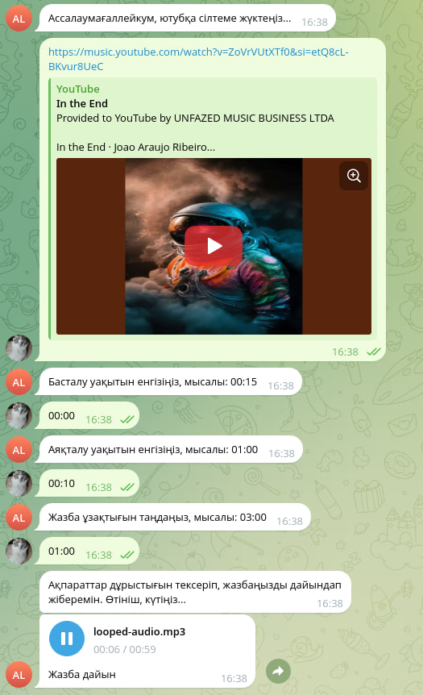

# YouTube Audio Looper

YouTube Audio Looper creates looped MP3 clips from a selected part of a YouTube video.

The project includes:

- REST API for generating looped audio.
- One-page web UI for using the API from a browser.
- Telegram bot for a step-by-step chat flow.
- Docker setup with FFmpeg and yt-dlp.

## Features

| Feature | Description |
| --- | --- |
| Web UI | Browser form for creating and downloading looped MP3 files |
| REST API | `POST /api/v1/audio/loop` returns generated MP3 audio |
| Telegram bot | Conversational flow for the same audio generation workflow |
| YouTube download | Uses `yt-dlp` and downloads only the requested video, not playlists |
| Segment extraction | Cuts the requested audio range with FFmpeg |
| Audio looping | Repeats the selected segment to the requested final duration |
| Validation | Validates YouTube URL, timestamps, clip length, and duration |
| Isolated jobs | Uses per-request temporary job directories and cleans them up |

## Requirements

- Go 1.26+
- FFmpeg
- yt-dlp
- Docker and Docker Compose, if running containerized

## Quick Start

Run the API and web UI:

```bash
go run ./cmd/api
```

Open the web app:

```text
http://localhost:8084/
```

Health check:

```bash
curl http://localhost:8084/health
```

## Web UI

The web UI is served by the API process:

- `GET /` serves `web/index.html`.
- `GET /web/*` serves static assets.
- The form sends JSON to `POST /api/v1/audio/loop`.
- Successful responses are shown as an audio player with a download link.
- Error responses are shown on the page.

Expected time fields use `MM:SS` or `HH:MM:SS`.

## API

### Create Looped Audio

```http
POST /api/v1/audio/loop
Content-Type: application/json
```

Request body:

```json
{
  "youtube_url": "https://www.youtube.com/watch?v=HDDdKCSn25Y",
  "start": "00:20",
  "end": "00:36",
  "duration": "01:00"
}
```

Successful response:

```http
200 OK
Content-Type: audio/mpeg
Content-Disposition: attachment; filename="looped-audio.mp3"
```

Error response:

```json
{
  "error": "invalid youtube url"
}
```

Example request:

```bash
curl -X POST http://localhost:8084/api/v1/audio/loop \
  -H "Content-Type: application/json" \
  -d '{
    "youtube_url": "https://www.youtube.com/watch?v=HDDdKCSn25Y&list=RDHDDdKCSn25Y&start_radio=1",
    "start": "00:20",
    "end": "00:36",
    "duration": "01:00"
  }' \
  --output result.mp3
```

Playlist and YouTube Mix URLs are accepted, but only the selected video is downloaded.

## Telegram Bot

Set environment variables:

```bash
export TELEGRAM_BOT_TOKEN=your_token
export AUDIO_API_URL=http://localhost:8084
```

Run the bot:

```bash
go run ./cmd/bot
```

Bot flow:

1. Start the bot with `/start`.
2. Send a YouTube URL.
3. Send the segment start timestamp.
4. Send the segment end timestamp.
5. Send the final audio duration.
6. Receive `looped-audio.mp3`.

## Docker

Build and run:

```bash
docker compose up --build
```

Then open:

```text
http://localhost:8084/
```

## Project Structure

```text
cmd/
├── api/                 # REST API and web UI entrypoint
└── bot/                 # Telegram bot entrypoint

internal/
├── bot/                 # Telegram handlers and state machine
├── client/              # API client used by the bot
├── config/              # Runtime configuration
├── downloader/          # yt-dlp wrapper
├── entity/              # Request and job models
├── handler/             # HTTP handlers
├── processor/           # FFmpeg processing
├── service/             # Audio service and job management
├── utils/               # Time and directory helpers
└── validator/           # Request validation

web/
├── index.html           # One-page web interface
├── script.js            # Form submission and result rendering
└── styles.css           # Web UI styles

docs/
└── images/              # Demo assets
```

## Processing Flow

```text
Request
  -> Validate URL and timestamps
  -> Create temporary job directory
  -> Download source audio with yt-dlp
  -> Cut selected segment with FFmpeg
  -> Loop segment to requested duration
  -> Return MP3 response
  -> Remove temporary files
```

## Validation Rules

- YouTube hosts: `youtube.com`, `www.youtube.com`, `m.youtube.com`, `music.youtube.com`, and `youtu.be`.
- Time format: `MM:SS` or `HH:MM:SS`.
- Final duration must be greater than zero.
- Selected segment must not be longer than the final duration.
- Final duration limit: 10 minutes.
- Selected segment limit: 60 seconds.

## Demo


